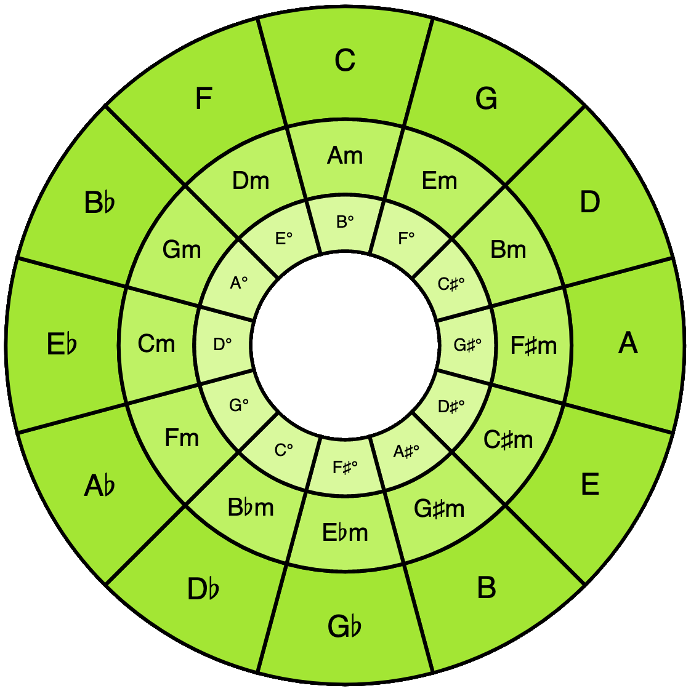

# React Circle of Fifths



[React Circle of Fifths on npm](https://www.npmjs.com/package/react-circle-of-fifths)

A beautiful, interactive, and highly customizable Circle of Fifths component for React.

# Getting Started

Install this package via npm:
``` bash
npm install react-circle-of-fifths
```

Or yarn:
``` bash
yarn add react-circle-of-fifths
```

Import the CircleOfFifths component...
``` tsx
import { CircleOfFifths } from "react-circle-of-fifths";
```

And render it!
``` tsx
    <CircleOfFifths />
```

# Consuming Selection
The CircleOfFifths takes an optional callback, which will be passed an object with information about the currently selected key whenever it selection changes. One way to take advantage of
this is to use a `useState` hook in the component that renders the CircleOfFifths component.

Note that if you want to leave this undefined at the start, and you're using Typescript, you'll need to provide a type argument to useState like so:

``` tsx
export function App() {
  const [key, setKey] = useState<CircleOfFifthsSelection | undefined>();

  return <>
    <h1 style={{textAlign: "center"}}>{key}</h1>
    <CircleOfFifths handleKeySelection={setKey}/>
  </>
```

The `CircleOfFifthSelection` object provides information about the currently selected key to the given callback. Currently, there are three fields (for more up-to-date info, see the [type definition](https://github.com/epiccoleman/react-circle-of-fifths/blob/main/src/CircleOfFifths.tsx#L14)). The `tonic` property is particularly useful if you're working with [tonal](https://github.com/tonaljs/tonal), as it's formatted to be consumable by the various APIs that tonal provides.
```
export type CircleOfFifthsSelection = {
    /**
     * The tonic note of the selected key. This string is formatted to be suitable
     * for calls to tonal.js.
     */
    tonic: string;
    /**
     * A nicely formatted string of the given note with symbols for sharps and flats,
     * suitable for display.
     */
    tonicDisplay: string;
    /**
     * The tonality of the selected key, either "major" or "minor".
     */
    tonality: "major" | "minor";
}
```

The default size of the SVG element this component renders is quite large, so you'll probably want to adjust the size via CSS. See the [demo application](https://github.com/epiccoleman/react-circle-of-fifths/tree/main/src/demo-app/) for a minimal example of using and styling the Circle.


# Styling the Circle of Fifths
The Circle of Fifths component ships with a default stylesheet and color theme. If this theme isn't to your liking, or doesn't fit well with the color theme of your application, you can customize the colors via CSS variables. Or, just copy-paste this block into the CSS file for your component, and change it to your liking!
``` css
.cf-theme {
    --cf-major-keys-fill: #84CC16;
    --cf-major-keys-fill-hover: #65A30D;
    --cf-major-keys-fill-selected:  #65A30D;
    --cf-minor-keys-fill: #84CC16;
    --cf-minor-keys-fill-hover: #65A30D;
    --cf-minor-keys-fill-selected:  #65A30D;
    --cf-diminished-keys-fill: #84CC16;

    --cf-stroke-color: black;
    --cf-stroke-width: 2px;
    --cf-text-color: black;
}
```

You can check out the [demo app](https://github.com/epiccoleman/react-circle-of-fifths/tree/main/src/demo-app/) for an example of how this works.

Note: One planned feature for this component is to allow styling via props. If this is something you'd use, drop me a line or comment on [the issue tracking this feature](https://github.com/epiccoleman/react-circle-of-fifths/issues/1) at this repo's Github page.

# Notes

This project is currently in early development. The component is fairly simple and should be ready for basic usage. However, some planned features are still missing. If you'd like to help, file an issue or email me at eric@epiccoleman.com!

If you're interested in learning more about the development of this component, I've been writing a series about it at [my personal site](https://epiccoleman.com/posts/2023-04-04-project-theory-dashboard.html).

# Funding

This project is licensed with the MIT license - which means you are free to use it for any purpose, free of charge, gratis, free as in beer, etc.

This project is also solely developed during the limited free time of a father of three with too many hobbies.

If you find this component valuable, time-saving, or just plain cool, please consider sponsoring the development of this project via [GitHub Sponsors](https://github.com/sponsors/epiccoleman). Any contribution you make will be greatly appreciated!